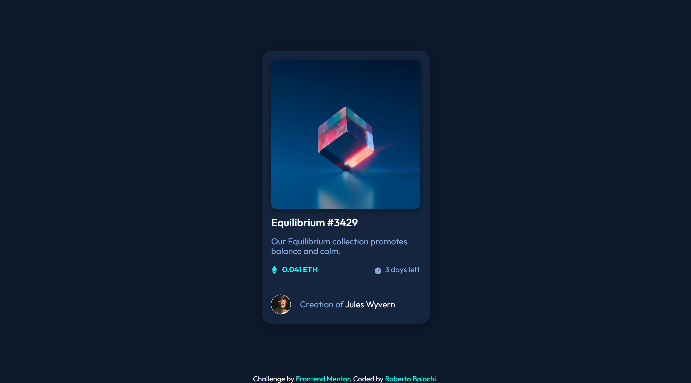
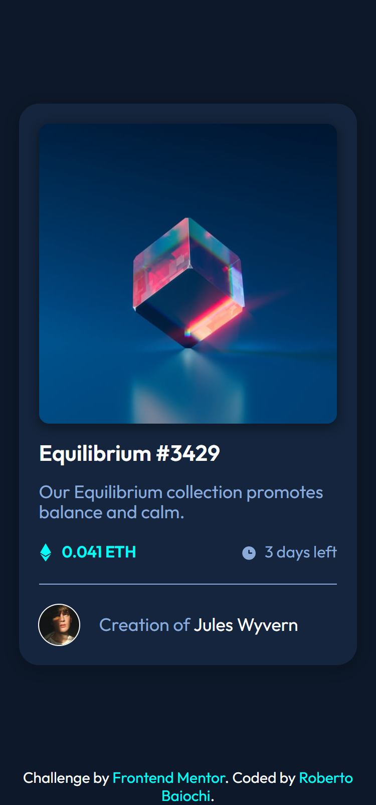

# Frontend Mentor - NFT preview card component solution

This is a solution to the [NFT preview card component challenge on Frontend Mentor](https://www.frontendmentor.io/challenges/nft-preview-card-component-SbdUL_w0U). Frontend Mentor challenges help you improve your coding skills by building realistic projects. 

## Table of contents

- [Overview](#overview)
  - [Screenshot](#screenshot)
  - [Links](#links)
- [My process](#my-process)
  - [Built with](#built-with)
  - [What I learned](#what-i-learned)
  - [Continued development](#continued-development)
- [Author](#author)
- [Acknowledgments](#acknowledgments)

## Overview
 It was a cool challenge :)

### Screenshot

### Links

- Live Url : 

## My process

### Built with

- Semantic HTML5 markup
- CSS custom properties
- Flexbox

### What I learned

In this challenge I was able to "play" a little with the ":hover" states and make some animations.

### Continued development

Make the job fun :D

## Author

- Frontend Mentor - [@RobertoBaiochi](https://www.frontendmentor.io/profile/RobertoBaiochi)

## Acknowledgments

I thank the entire community, it's unbelievable the amount of good people I ended up meeting as soon as I started studying, you guys are inspiring and I hope one day I can be too. :D
